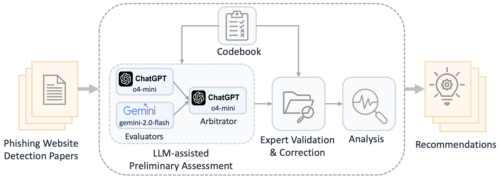

# PHILTER

**PH**ishing detection literature **I**nspection via **L**LMs and **T**argeted **E**xpert **R**eview.

PHILTER is a transparent, scalable, and evidence-driven framework for assessing AI-based phishing website detection papers against four functionality (F1-F4) and three security (S1-S3) metrics. LLM preliminary assessment pipeline extracts supporting text from the paper and generates rationales for its assessment. Two experts independently validate all LLM-generated preliminary assessments by checking the extracted evidence and rationale against the paper and the codebook, correcting misinterpretations. Any disagreements were resolved through discussion. Applying PHILTER to 55 studies reveals systemic gaps and trade-offs.

---

## Framework Overview



### LLM-assisted Preliminary Assessment

- Evaluators: Two evaluator LLMs (OpenAI o4-mini and Google Gemini-2.5-Pro) independently extract supporting text from each paper and generate a preliminary assessment with rationale.

- Arbitrator: When the two evaluators disagree, an arbitrator LLM (OpenAI o4-mini) reviews the full paper, codebook, and both evaluator assessments, and generates an arbitrated assessment with its own rationale and extracted evidence.


## 📦 Repository layout

```bash
PHILTER/
├─ codebook/
│  ├─ f1-coverage.txt
│  ├─ f2-benign-diversity.txt
│  ├─ f3-interpretability.txt
│  ├─ f4-evaluation-thoroughness.txt
│  ├─ s1-concept-drift.txt
│  ├─ s2-active-attack.txt
│  └─ s3-privacy.txt
├─ llm_responses/
├─ papers/
├─ scripts/
│  ├─ assessments_table_expert.py
│  ├─ fulfillment_by_accuracy.py
│  ├─ fulfillment_by_category.py
│  ├─ fulfillment_by_citation.py
│  ├─ fulfillment_by_deployment_mode.py
│  ├─ fulfillment_by_detection_mode.py
│  ├─ fulfillment_by_input.py
│  ├─ fulfillment_by_publication_year.py
│  ├─ llm_vs_expert_agreement_rates.py
│  └─ llm_vs_expert_assessments.py
├─ llm_assessment_pipeline.py
├─ assessments.json # Contains LLM assessments and expert assessments
├─ README.md
└─ requirements.txt
```

## LLM Assessment Pipeline Script

```bash
python llm_assessment_pipeline.py --help                                              
Both GOOGLE_API_KEY and GEMINI_API_KEY are set. Using GOOGLE_API_KEY.
usage: llm_assessment_pipeline.py [-h] [-p PDF_PATH] [-m METRIC_PATH] [-o OUTPUT_JSON] [--override] [--no-cache]

options:
  -h, --help            show this help message and exit
  -p PDF_PATH, --pdf-path PDF_PATH
                        PDF file or directory
  -m METRIC_PATH, --metric-path METRIC_PATH
                        Metric file or directory
  -o OUTPUT_JSON, --output-json OUTPUT_JSON
                        Assessment output JSON file
  --override            Override previously processed results
  --no-cache            Invokes LLMs to recalculate verdicts, ignoring cached results
```

## LLM Assessment

```bash
# 1) Put the research papers on phishing website detection inside `papers` directory.

# 2) Create env (Python 3.10–3.12 recommended)
python -m venv .venv && source .venv/bin/activate

# 3) Install dependencies
pip install -r requirements.txt

# 4) Set OpenAI and Gemini API keys
export OPENAI_API_KEY=...
export GEMINI_API_KEY=...

# 5) Run LLM-assisted prelimiary evaluation stage
python llm_assessment_pipeline.py -p . -m codebook/f1-coverage.txt -o assessments.json

# 6) To run the assessment pipeline for all metrics, provide the directory containing the codebooks for all metrics in argument `-m`.

python llm_assessment_pipeline.py -p . -m codebook -o assessments.json

```


## Contents of assessments.json

This file contains the structured evaluation results for each phishing website detection paper analyzed in our study. Each entry corresponds to a single paper and includes:

- **Metadata**: Year, venue, citation count, method name, and paper key.  
- **Category & Inputs**: Detection strategy category (e.g., feature-based, similarity-based, identity-based, hybrid) and input requirements (e.g., URL, webpage content).  
- **Performance Metrics**: Reported accuracy, precision, recall, and F1, detection mode (real-time vs. offline), deployment mode (client-side vs. server-side).  
- **Codebook Metrics**: Evaluations under the PHILTER framework. For each metric, multiple assessments are stored:  
  - `manual`: Expert’s final label.  
  - `manual_reasoning`: Explanation for the manual label.  
  - `chatgpt`: Assessment generated by ChatGPT (includes value, reasoning, and supporting evidence).  
  - `gemini`: Assessment generated by Gemini (includes value, reasoning, and supporting evidence). 
  - `arbitrator`: Final reconciled label after resolving disagreements (includes value, reasoning, and supporting evidence).

  Metrics include:  
  - **F1 – Diversity of Phishing Tactics**  
  - **F2 – Diversity of Benign Pages**  
  - **F3 – Interpretability**  
  - **F4 – Evaluation Transparency**  
  - **S1 – Adaptation to Concept Drift**  
  - **S2 – Resistance to Active Attacks**  
  - **S3 – Privacy Preservation**

## Analysis Scripts
We provide following analysis scripts (`scripts` directory) to generate the summary tables from the final validated labels.

- Generate rows for Table 3 (Final expert validated assesments for individual papers)

  `python scripts/assessments_table_expert.py`

- Generate rows for Table 4 (Metric fulfillment vs. detection strategy)

  `python scripts/fulfillment_by_category.py`

- Generate rows for Table 5 (Metric fulfillment vs. input source)

  `python scripts/fulfillment_by_input.py`

- Generate rows for Table 6 (Metric fulfillment vs. deployment mode)
  
  `python scripts/fulfillment_by_deployment_mode.py` 

- Generate rows for Table 7 (Metric fulfillment vs. detection mode)

  `python scripts/fulfillment_by_detection_mode.py`

- Generate rows for Table 8 (Metric fulfilment vs. accuracy)

  `python scripts/fulfillment_by_accuracy.py`

- Generate rows for Table 9 (Metric fulfillment vs. publication year)

  `python scripts/fulfillment_by_publication_year.py`


- Generate rows for Table 10 (Metric fulfillment vs. citation count)

  `python scripts/fulfillment_by_citation.py`

- Generate rows for Table 12 (LLM vs Expert agreement on PHILTER metrics)

  `python scripts/llm_vs_expert_agreement_rates.py`

- Generate rows for Table 13 ( Per-paper agreement between LLM-generated labels and expert-validated labels)

  `python scripts/llm_vs_expert_assessments.py`

- Generate chi-square tests for detection strategy

  `python scripts/fulfillment_by_category.py`
  
  `python scripts/chi_square_tests_for_category.py`

- Generate chi-square tests for deployment mode

  `python scripts/chi_square_tests_for_deployment_mode.py`

- Generate chi-square tests for detection mode

  `python scripts/chi_square_tests_for_detection_mode.py`